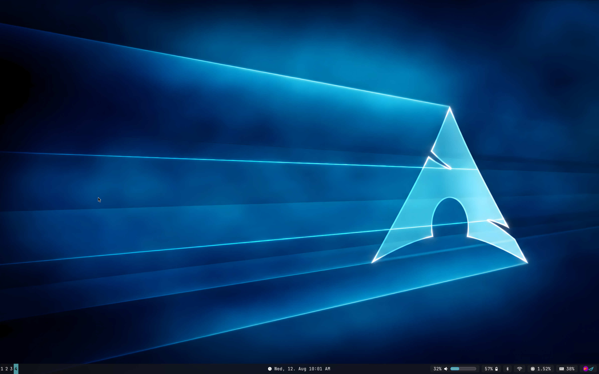

# My Waybar Configurations (Dotfiles)
By Dodoprospy3

---



---

> **Warning:** This configuration requires Hyprland 0.56.X and may not work correctly on other versions. The author is not responsible for any problems caused by using this configuration.

---

> for the record, I don't use this config anymore because I switched to ***Omarchy***, but I will still maintain it so anyone can use it and also I still can recieve sand respond to issues and pull requests

---

## Requirements

Before installing this Waybar configuration, make sure you have the following installed.

### Required Software

* **Hyprland 0.56.X**
  This configuration was made for Hyprland 0.56.X and may not work correctly with other versions.

* **Waybar v0.15.0 or newer**
  Waybar is the program that displays the bar.

* **Git**
  Git is used to download this configration from GitHub.

* **Blueman 2.4.6-2 or newer**
  Blueman provides the Bluetooth manager used by the Bluetooth module.

* **Pavucontrol**
  used to open the aadio settings when clicking the volume module.

* **Playerctl**
  Used by the media controls.

* **Kitty**
  uSed to open a terminal when clicking the CPU and memory modules.

* **btop**
  Opens when clicking the CPU module.

* **htop**
  Opens when clicking the memory module.

<!-- * **Chromium** ##will be edited to and add other browser compatibility##
  Opens Google Calendar when clicking the clock.
-->
* **NetworkManager**
  Used to manage Wi-Fi and Ethernet connections.

* **nmrs**
  Used to open the Wi-Fi/network selection menu when clicking the network module.

* **A Nerd Font**
  This configuration uses Nerd Font icons. **JetBrainsMono Nerd Font** is recommended. if you don't want to use it, you will need to edit the config

### Installing on Arch Linux (or any arch based distro)

If you are using Arch Linux or an Arch-based distribution, install the main packages with:

```bash
sudo pacman -S waybar git blueman pavucontrol playerctl kitty btop htop networkmanager
```

Then install the recommended Nerd Font:

```bash
sudo pacman -S ttf-jetbrains-mono-nerd
```
to install `nmrs`, run this command:

```bash
git clone https://aur.archlinux.org/nmrs.git
cd nmrs
makepkg -si
```

### That's It

You do **not** need to install any additional media scripts or dependencies. The old custom media scripts are no longer part of this configuration.

If you already have some of these programs installed, you do not need to install them again.


---

## How to set up

First, run this command to go to the waybar Directory
```bash
cd ~/.config/waybar/
```

If it doesn't exist create it yourself
```bash
mkdir ~/.config/waybar/
```

Then go into it again
```bash
cd ~/.config/waybar
```

Then run this command to clone the repo to your directory

```bash
git clone https://github.com/Dodoprospy3/my-waybar-config.git .
```
Now if you run ```waybar``` in your terminal, it will show up. 
Then close your terminal or press ```Ctrl+c```, don't worry I know that your beatiful waybar that you just stole from me is gone, 
Then go into your `hypr` Directory

```bash
cd ~/.config/hypr/
```

then run ```ls```
you should see `hyprland.lua`

Use your preferred text editor to edit `hyprland.lua`

> **WARNING**: If your preferred text editor is Ema*s, reconsider your life choices.
> 
>Vim/Neovim users are welcome. Emacs users will be judged. Nano users are beyond my ability to comprehend.

```bash 
<YOUR-TEXT-EDITOR> hyprland.lua
``` 
then anywhere in that file add

```lua
hl.on("hyprland.start", function()
    hl.exec_cmd("waybar &")
end)
```

then save and exit.

Finally, log out and log back in, and... **BOOM**! you have your (mine actually) waybar!

---

If you encounter any problems or difficulties, don't hesitate to ask me for help. Have a nice Waybar!
